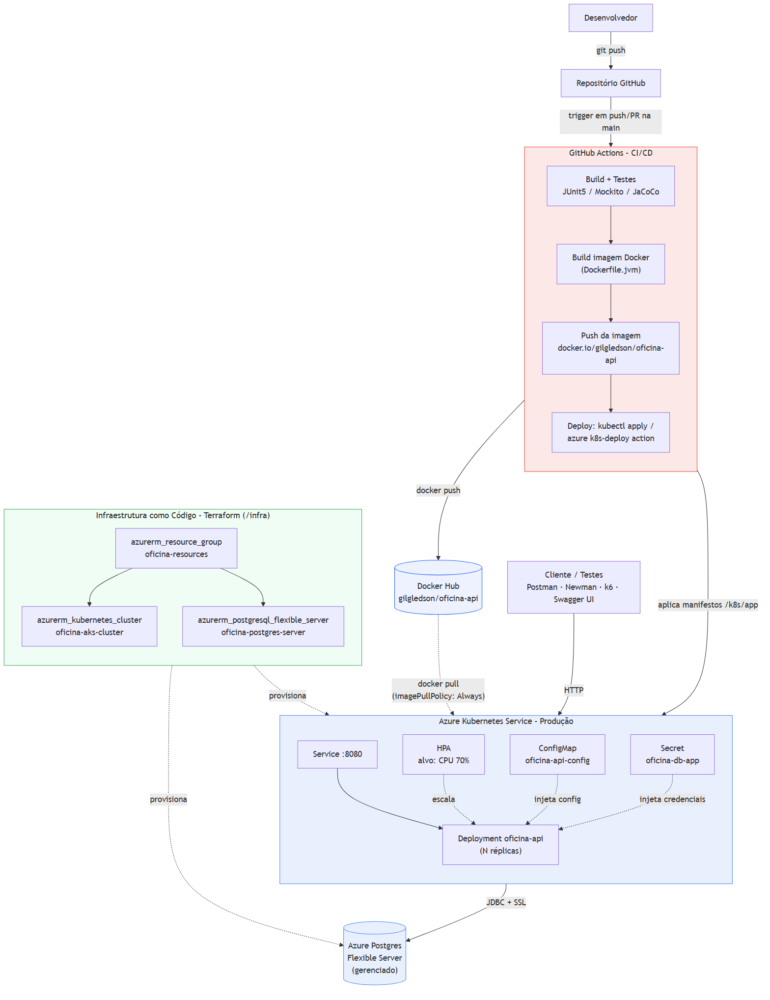

# 🔧 Oficina API

> API RESTful para gestão de uma **Oficina Mecânica**, desenvolvida como parte do **Tech Challenge da FIAP**, aplicando os princípios de **Domain-Driven Design (DDD)** e **Clean Architecture**.


---

## 📋 Sumário

- [Sobre o Projeto](#-sobre-o-projeto)
- [Arquitetura](#-arquitetura)
- [Módulos](#-módulos)
- [Tecnologias](#-tecnologias)
- [Banco de Dados](#-banco-de-dados)
- [Como Executar](#-como-executar)
- [Arquitetura de Infraestrutura e Deploy (Fase 2)](#-arquitetura-de-infraestrutura-e-deploy-fase-2)
- [Infraestrutura como Código (Terraform)](#-infraestrutura-como-código-terraform)
- [Deploy em Kubernetes](#-deploy-em-kubernetes)
- [API Gateway (Traefik)](#-api-gateway-traefik)
- [Observabilidade (New Relic)](#-observabilidade-new-relic)
- [Endpoints](#-endpoints)
- [Testes](#-testes)
- [Cobertura de Código](#-cobertura-de-código)

---

## 🚀 Sobre o Projeto

A **Oficina API** é um sistema backend para gerenciamento completo de uma oficina mecânica, cobrindo desde o catálogo de produtos e serviços até o controle de clientes, veículos e ordens de serviço.

O projeto foi desenvolvido utilizando **Quarkus**, o framework Java nativo em nuvem, com foco em alta performance e arquitetura limpa.

---

## 🏛️ Arquitetura

O projeto segue os princípios de **Clean Architecture** combinados com **Domain-Driven Design (DDD)**, organizando o código em camadas bem definidas e com dependências apontando sempre para o domínio.

```
src/main/java/.../modules/<contexto>/<agregado>/
│
├── domain/                  ← Entidades, Value Objects e regras de negócio puras
│   ├── entity/
│   └── valueobject/
│
├── application/             ← Casos de uso (UseCases), repositórios (interfaces) e DTOs de saída
│   ├── dto/
│   ├── mapper/
│   ├── repository/          ← Interfaces (contratos)
│   └── usecase/
│
├── infrastructure/          ← Implementações concretas (JPA, Panache)
│   └── persistence/
│
└── api/                     ← Controllers REST, DTOs de entrada/saída e mappers de API
    ├── controller/
    └── dto/
```

### Contextos Delimitados (Bounded Contexts)

| Contexto | Agregados |
|---|---|
| `catalogo` | `produto`, `servico` |
| `atendimento` | `cliente`, `veiculo` |
| `identidade` | *(autenticação via JWT)* |
| `operacional` | `ordemdeservico`, `funcionario` |
| `orcamento` | `orcamento` |
| `notificacao` | `envio de mensagens` |
| `relatorios` | `métricas operacionais` |

---

## 📦 Módulos

### 🗂️ Catálogo

| Recurso | Descrição |
|---|---|
| **Produto** | Gestão de peças e insumos com controle de estoque, código de barras e unidade de medida |
| **Serviço** | Gestão de serviços da oficina com tipos (`MANUTENCAO_PREVENTIVA`, `MANUTENCAO_CORRETIVA`) e produtos sugeridos |

### 🧾 Atendimento

| Recurso | Descrição |
|---|---|
| **Cliente** | Cadastro de clientes com endereço completo, CPF/CNPJ e vínculo com usuário |
| **Veículo** | Cadastro de veículos vinculados a clientes, com placa, marca, modelo e ano |

### 🛠️ Operacional

| Recurso | Descrição |
|---|---|
| **Ordem de Serviço** | Ciclo de vida completo (Diagnóstico -> Execução -> Entrega) com controle de esforço e itens |
| **Funcionário** | Cadastro de mecânicos e atendentes vinculados a usuários do sistema |

### 💰 Orçamento

| Recurso | Descrição |
|---|---|
| **Orçamento** | Geração de orçamentos em PDF (Qute), aprovação manual com assinatura e gestão de faturamento |

### 📊 Relatórios

| Recurso | Descrição |
|---|---|
| **Esforço por OS** | Cálculo automático do tempo total de intervenção (minutos) em cada Ordem de Serviço finalizada |
| **Tempo Médio** | Média histórica de execução de cada tipo de serviço para otimização de agenda e custos |

---

## ⚙️ Tecnologias

| Tecnologia | Versão | Uso |
|---|---|---|
| [Quarkus](https://quarkus.io/) | 3.34.5 | Framework principal (runtime Java nativo em nuvem) |
| [Eclipse Vert.x](https://vertx.io/) | — | Comunicação reativa e EventBus para eventos internos de comunicação entre módulos |
| [Java](https://www.java.com/) | 17 | Linguagem de programação |
| [Hibernate ORM + Panache](https://quarkus.io/guides/hibernate-orm-panache) | — | Persistência e repositórios JPA |
| [PostgreSQL](https://www.postgresql.org/) | — | Banco de dados relacional |
| [Flyway](https://flywaydb.org/) | — | Versionamento e migração de banco de dados |
| [DataFaker](https://www.datafaker.net/) | 2.2.2 | Geração de dados realistas para semeadura (Seeding) |
| [SmallRye JWT](https://quarkus.io/guides/security-jwt) | — | Autenticação e autorização via tokens JWT |
| [SmallRye OpenAPI](https://quarkus.io/guides/openapi-swaggerui) | — | Documentação automática da API (Swagger UI) |
| [Hibernate Validator](https://hibernate.org/validator/) | — | Validação de dados de entrada (Bean Validation) |
| [Lombok](https://projectlombok.org/) | 1.18.34 | Redução de boilerplate (getters, construtores) |
| [JUnit 5](https://junit.org/junit5/) | — | Framework de testes unitários |
| [Mockito](https://site.mockito.org/) | 5.11.0 | Mock de dependências nos testes unitários |
| [JaCoCo](https://www.jacoco.org/) | 0.8.12 | Cobertura de código dos testes |
| [Maven](https://maven.apache.org/) | — | Gerenciamento de dependências e build |

---

## 🌱 Semeadura de Dados (Seeding)

Para facilitar o desenvolvimento e testes, implementamos um sistema de **Semeadura Modular** que popula o banco de dados automaticamente ao iniciar a aplicação em ambiente de desenvolvimento.

### Como funciona:
- **Ativação Automática**: O sistema detecta o profile (`quarkus.profile`) e executa apenas se **não** for `prod`.
- **Arquitetura Modular**: Cada módulo possui seu próprio `Seeder` e `Factory` utilizando a biblioteca **DataFaker**.
- **Dados Gerados**:
  - **Identidade**: Usuários administradores, mecânicos e atendentes.
  - **Catálogo**: Produtos com estoque e serviços variados.
  - **Atendimento**: Clientes com endereços brasileiros reais e veículos vinculados.
  - **Operacional**: Gerador automático de 50 Ordens de Serviço distribuídas nos últimos 90 dias, com funcionários atribuídos e tempos de execução randômicos para visualização de métricas reais nos relatórios.

---

## 🗄️ Banco de Dados

O schema é versionado via **Flyway** com migrations incrementais:

| Migration | Descrição |
|---|---|
| `V1.0.0` | Criação da tabela de usuários |
| `V1.0.1` | Criação das tabelas de catálogo (`PRODUTO`, `SERVICO`) |
| `V1.0.2` | Criação das tabelas de atendimento (`CLIENTE`, `VEICULO`) |
| `V1.0.3` | Criação da tabela de Ordem de Serviço |
| `V1.0.4` | Criação das tabelas de itens da OS |
| `V1.0.5` | Criação da tabela de fatura |
| `V1.0.6` | Alterações nas tabelas de `CLIENTE` e `VEICULO` (exclusão lógica, email) |
| `V1.0.9` | Criação da tabela de fatura |
| `V1.1.0` | Adição de suporte a reserva de estoque no catálogo |
| `V1.1.1` | Controle de concorrência otimista (Versioning) para produtos |
| `V1.1.22` | Criação de views para relatórios de esforço e tempo médio |
| `V1.1.24` | Renomear tabela de fatura para orçamento |
| `V2` *(testdata)* | Seeds de produtos e serviços para ambiente de testes |

---

## 🏗️ Arquitetura de Monolito Modular

O projeto foi refatorado para uma estrutura de **Monolito Modular**, garantindo o baixo acoplamento entre os contextos de negócio:

### Comunicação entre Módulos

O sistema utiliza uma arquitetura baseada em **Eventos (Event-Driven)** e **Gateways** para garantir que os módulos sejam independentes e desacoplados:

- **EventBus (Vert.x)**: Comunicação assíncrona para disparar notificações, atualizar estoque e sincronizar estados entre contextos (ex: Aprovação de Orçamento -> Início da OS).
- **Gateways**: Interfaces que definem os contratos de consulta entre módulos, evitando o acoplamento direto entre entidades JPA.
- **SnapshotDTOs**: Troca de informações através de objetos imutáveis, protegendo a integridade do domínio de cada contexto.
- **Isolamento de Banco**: Cada módulo gerencia suas próprias tabelas, respeitando as fronteiras do contexto delimitado.


### 📦 Gestão de Estoque
Implementamos uma lógica de reserva de estoque robusta para evitar vendas de produtos inexistentes:

1.  **Quantidade Física**: Representa o que realmente existe na prateleira.
2.  **Quantidade Reservada**: Representa itens vinculados a Ordens de Serviço abertas/aprovadas.
3.  **Quantidade Disponível**: Calculada dinamicamente (`Física - Reservada`).

**Ciclo de Vida:**
- **Inclusão na OS**: O sistema incrementa a `Quantidade Reservada`.
- **Finalização da OS**: O sistema decrementa tanto a `Quantidade Física` quanto a `Reservada`.
- **Cancelamento da OS**: O sistema decrementa a `Quantidade Reservada`, tornando o item disponível novamente.

### ⚙️ Ciclo de Vida da Ordem de Serviço (Máquina de Estados)
A Ordem de Serviço (OS) segue uma transição estrita de estados para garantir consistência operacional:
- **AGUARDANDO_APROVACAO**: Permite adição de serviços, produtos e envio de orçamentos para o cliente. Serviços corretivos **não** podem ser rejeitados nesta etapa.
- **APROVADA**: Indica que o orçamento foi aceito. Apenas serviços com status `APROVADO` podem ter sua execução iniciada pelos mecânicos.
- **EM_EXECUCAO**: Fase onde os mecânicos iniciam e finalizam tarefas em tempo real, acompanhando a duração exata de cada intervenção.
- **CONCLUIDA**: Encerra a OS. Aciona eventos no EventBus que disparam a baixa de estoque e preparam os dados para faturamento automático.

### 📄 Faturamento e Geração de Documentos
O módulo de faturamento é totalmente assíncrono e dissociado:
- **Separação de Módulos**: Ele coleta dados via "Gateways" (Padrão Adapter), sem referenciar diretamente as tabelas de outros contextos.
- **Geração PDF (Qute + Flying Saucer)**: O Quarkus utiliza sua engine de templates HTML estáticos (Qute) para renderizar layouts premium de nota fiscal (fatura) injetando produtos aninhados em serviços.
- **Baixa Financeira**: Permite confirmar pagamento para liberação e entrega definitiva do veículo ao cliente.

---

## ▶️ Como Executar

### Pré-requisitos

- Java 17+
- Maven 3.8+
- Docker & Docker Compose

### 1. Build do Pacote

Gere o artefato da aplicação ignorando os testes unitários:

```bash
./mvnw clean package -DskipTests
```

### 2. Subir o ambiente com Docker Compose

Com o pacote gerado, inicie os containers do banco de dados e da API:

```bash
docker-compose up -d
```

> A aplicação estará disponível em: `http://localhost:8383`

### 3. Acesse o Swagger UI

A documentação completa da API pode ser acessada em:
[http://localhost:8383/q/swagger-ui/#/](http://localhost:8383/q/swagger-ui/#/)

---

## 🏗️ Arquitetura de Infraestrutura e Deploy (Fase 2)

### Objetivo desta fase

A Fase 2 do Tech Challenge evolui a aplicação da Fase 1 para garantir **qualidade, resiliência e escalabilidade**, incorporando infraestrutura como código, conteinerização, orquestração via Kubernetes e automação de CI/CD — preparando a oficina para suportar picos de demanda com escalabilidade dinâmica.

### Componentes, infraestrutura provisionada e fluxo de deploy

A infraestrutura roda inteiramente na nuvem (Azure), provisionada via **Terraform** (`/infra`):

- **Resource Group** (`oficina-resources`), **AKS** (`oficina-aks-cluster`) e **Postgres Flexible Server** (`oficina-postgres-server`, banco gerenciado).
- O **deploy** é feito diretamente pelo **GitHub Actions** a cada push na `main`: build da aplicação, execução dos testes (JUnit5/Mockito/JaCoCo), build da imagem Docker, **push da imagem para o Docker Hub** (`docker.io/gilgledson/oficina-api`) e aplicação dos manifestos de `/k8s/app` no AKS via `kubectl`/`azure k8s-deploy`.
- O `Deployment oficina-api` no AKS referencia essa mesma imagem do Docker Hub (`imagePullPolicy: Always`) — o cluster sempre puxa a versão mais recente publicada a cada deploy.
- No cluster, o **HPA** escala o `Deployment oficina-api` com base em uso de CPU (alvo 70%), e a configuração/credenciais são injetadas via `ConfigMap`/`Secret`, nunca hardcoded no código-fonte.
- A aplicação conecta no Postgres Flexible Server via JDBC com SSL.



> Fonte editável: [docs/diagrama-arquitetura-infraestrutura.mmd](docs/diagrama-arquitetura-infraestrutura.mmd) (Mermaid).

### 🔗 Entregáveis

- **Collection completa das APIs (Postman):** [docs/postman_collection.json](docs/postman_collection.json)
- **Documentação interativa (Swagger UI):** disponível em `/q/swagger-ui/#/` após subir a aplicação
- **Vídeo demonstrativo (até 15 min):** [Assista aqui](https://drive.google.com/file/d/1TqMzNbciNb-3_zPpxVR6hI0vbInDfhIA/view?usp=sharing) (roteiro de gravação: [docs/roteiro-video-apresentacao.md](docs/roteiro-video-apresentacao.md))

---

## ☁️ Infraestrutura como Código (Terraform)

Para provisionar o ambiente na nuvem (Azure), o projeto inclui scripts automatizados utilizando **Terraform**. Os arquivos de configuração estão localizados na pasta `/infra`.

### Recursos Provisionados
Os seguintes recursos são criados automaticamente na Azure:
- **Resource Group:** Agrupamento lógico para todos os recursos da aplicação (`oficina-resources`).
- **PostgreSQL Flexible Server:** Banco de dados gerenciado em nuvem (`database.tf`).
- **Azure Kubernetes Service (AKS):** Cluster Kubernetes gerenciado para implantação da aplicação (`aks.tf`), configurado com um node pool econômico.
- **Storage Account + Blob Container:** Armazenamento das assinaturas de aceite de orçamento (`storage.tf`), usado em produção. Disco local do pod é efêmero — some a cada restart/redeploy e não é compartilhado entre réplicas do HPA.

#### Armazenamento de assinatura: local ou Azure Blob Storage

A aplicação implementa `AssinaturaStorageService` de duas formas, e escolhe qual usar **em runtime** pela variável `STORAGE_TYPE` (ver `StorageServiceProducer`):

| `STORAGE_TYPE` | Implementação | Onde roda |
|---|---|---|
| `local` (padrão) | `LocalFileStorageService` — grava em `uploads/assinaturas/` no disco do processo | Dev local — definido explicitamente no `docker-compose.yaml` |
| `azure` | `AzureBlobStorageService` — grava no Storage Account provisionado via Terraform (`storage.tf`) | Produção (AKS) — definido em `k8s/app/configMap.yaml` |

Para testar o modo Azure localmente, defina `STORAGE_TYPE=azure` e `AZURE_STORAGE_CONNECTION_STRING` (ex.: apontando para o emulador [Azurite](https://learn.microsoft.com/azure/storage/common/storage-use-azurite) ou para um Storage Account real).

### Como aplicar a infraestrutura

**Pré-requisitos:**
- [Terraform CLI](https://developer.hashicorp.com/terraform/downloads) instalado.
- [Azure CLI](https://learn.microsoft.com/en-us/cli/azure/install-azure-cli) instalada e autenticada (`az login`).

**Passos:**
1. Navegue até o diretório de infraestrutura:
   ```bash
   cd infra
   ```
2. Inicialize o Terraform para baixar os provedores necessários:
   ```bash
   terraform init
   ```
3. Defina as variáveis sensíveis obrigatórias (nenhuma tem default, por segurança):
   ```bash
   # Linux/macOS
   export TF_VAR_db_admin_password="uma-senha-forte-aqui"           # Postgres, mínimo 12 caracteres
   export TF_VAR_jwt_private_key_pem="$(cat ../src/main/resources/privateKey.pem)"  # Function de auth por CPF
   export TF_VAR_newrelic_account_id="sua-account-id"                # one.newrelic.com > Account Settings
   export TF_VAR_newrelic_api_key="sua-user-api-key"                 # NRAK-..., não é a license key do agent

   # Windows (PowerShell)
   $env:TF_VAR_db_admin_password = "uma-senha-forte-aqui"
   $env:TF_VAR_jwt_private_key_pem = Get-Content ..\src\main\resources\privateKey.pem -Raw
   $env:TF_VAR_newrelic_account_id = "sua-account-id"
   $env:TF_VAR_newrelic_api_key = "sua-user-api-key"
   ```
4. Visualize o plano de execução para revisar os recursos que serão criados:
   ```bash
   terraform plan
   ```
5. Aplique as configurações para provisionar os recursos (confirme com `yes`):
   ```bash
   terraform apply
   ```
6. Para destruir a infraestrutura posteriormente (evitar custos adicionais):
   ```bash
   terraform destroy
   ```

---

## ☸️ Deploy em Kubernetes

Depois que o AKS existe (via Terraform, passo anterior), a aplicação é implantada automaticamente pelo **GitHub Actions** a cada push na `main` (job `build-and-deploy` do [ci.yml](.github/workflows/ci.yml)): build da imagem, push para o Docker Hub, e aplicação dos manifestos de `/k8s/app` via `Azure/k8s-deploy`.

### Segredos necessários na pipeline (GitHub Actions → Settings → Secrets)

| Secret | Uso |
|---|---|
| `DOCKERHUB_USERNAME` / `DOCKERHUB_TOKEN` | Login e push da imagem no Docker Hub |
| `AZURE_CREDENTIALS` | Autenticação no Azure (`azure/login`) |
| `DB_APP_USERNAME` / `DB_APP_PASSWORD` | Credenciais que a API usa para conectar no Postgres Flexible Server (injetadas no `Secret` do K8s) |
| `WEBHOOK_APROVACAO_SECRET` | Secret do endpoint `/api/ordens/{id}/aprovacao-externa` |
| `AZURE_STORAGE_CONNECTION_STRING` | Connection string do Storage Account (assinaturas de orçamento) — saída sensível `storage_connection_string` do Terraform |
| `NEW_RELIC_LICENSE_KEY` | License key do New Relic (APM) — injetada no `Secret` do K8s e lida pelo New Relic Java Agent |

> Os manifestos em `k8s/app/secret.yaml` usam placeholders `${...}` — a pipeline os preenche via `envsubst` antes do apply. **Nunca** commitar os valores reais no lugar dos placeholders.

### Deploy manual (sem esperar o CI/CD)

Com o `kubectl` já apontando para o cluster (`az aks get-credentials --resource-group oficina-resources --name oficina-aks-cluster`):

```bash
kubectl apply -f k8s/app/configMap.yaml

kubectl create secret generic oficina-db-app \
  --from-literal=username=adminuser \
  --from-literal=password="sua-senha" \
  --from-literal=webhook-aprovacao-secret="seu-secret" \
  --from-literal=azure-storage-connection-string="sua-connection-string" \
  --from-literal=new-relic-license-key="sua-license-key" \
  --dry-run=client -o yaml | kubectl apply -f -

kubectl apply -f k8s/app/deployment.yaml
kubectl apply -f k8s/app/service.yaml
kubectl apply -f k8s/app/hpa.yaml

kubectl apply -f k8s/gateway/ingress.yaml

kubectl rollout status deployment/oficina-api
```

> O `oficina-api-service` agora é `ClusterIP` (sem IP público próprio). O acesso
> externo é feito através do **API Gateway** — veja a seção seguinte.

---

## 🚪 API Gateway (Traefik)

A aplicação não é mais exposta diretamente ao público. Todo o tráfego externo
passa por um **API Gateway** ([Traefik](https://traefik.io/)) implantado no
próprio cluster AKS, responsável pelo roteamento e controle de acesso às APIs.

```
Internet → Service traefik (LoadBalancer, :80) → Traefik (Ingress Controller)
         → Ingress oficina-api-ingress → Service oficina-api-service (ClusterIP, :8080)
         → Pods oficina-api
```

Manifestos em [`k8s/gateway`](k8s/gateway):

| Arquivo | Recurso | Função |
|---|---|---|
| `namespace.yaml` | `Namespace: gateway` | Isola os recursos do gateway |
| `rbac.yaml` | `ServiceAccount` / `ClusterRole` / `ClusterRoleBinding` | Permite o Traefik observar `Ingress`, `Service`, `Endpoints` e `Secret` no cluster |
| `ingressclass.yaml` | `IngressClass: traefik` | Registra o Traefik como controller de Ingress |
| `deployment.yaml` | `Deployment: traefik` | Roda o Traefik (provider `kubernetesingress`) |
| `service.yaml` | `Service: traefik` (LoadBalancer, porta 80) + `Service: traefik-dashboard` (ClusterIP, porta 8080) | Expõe o gateway publicamente e o dashboard só internamente |
| `ingress.yaml` | `Ingress: oficina-api-ingress` (namespace `default`) | Roteia todo o tráfego (`/`) para `oficina-api-service:8080` |

Esses manifestos são aplicados automaticamente pelo job `build-and-deploy` do
[ci.yml](.github/workflows/ci.yml) antes do deploy da aplicação.

### Como acessar a API pelo gateway

```bash
# IP público do gateway (pode levar alguns minutos até o Azure provisionar)
kubectl get service traefik -n gateway

# Exemplo de chamada, já passando pelo API Gateway
curl http://<EXTERNAL-IP>/api/produtos
curl http://<EXTERNAL-IP>/q/swagger-ui/
```

### Dashboard do Traefik (uso local, não exposto publicamente)

```bash
kubectl port-forward -n gateway svc/traefik-dashboard 8080:8080
# abrir http://localhost:8080/dashboard/
```

---

## 📊 Observabilidade (New Relic)

### Logs estruturados em JSON com correlação entre requisições

Todo log vai pro stdout já em JSON (extensão `quarkus-logging-json`). Um
[`CorrelationIdFilter`](src/main/java/br/com/fiap/oficina/api/shared/infrastructure/web/CorrelationIdFilter.java)
gera (ou reaproveita, se o cliente já mandou) um `X-Correlation-Id` por
requisição, coloca no MDC — aparece em todo log daquela requisição — e devolve
no header de resposta, pra permitir correlacionar com outros serviços na
mesma cadeia de chamadas. O próprio filtro loga uma linha por requisição
(método, path, status, duração):

```json
{"timestamp":"...","loggerName":"...CorrelationIdFilter","level":"INFO","message":"POST /api/usuarios/login -> 200 (216ms)","mdc":{"correlationId":"82b63b79-..."}}
```

### APM (latência, erros, throughput)

O [Dockerfile.jvm](src/main/docker/Dockerfile.jvm) baixa o **New Relic Java
Agent** na build e anexa via `-javaagent`. Ele instrumenta JAX-RS/JDBC
automaticamente — sem precisar de código customizado — reportando latência,
throughput e erros por endpoint. Sem a env var `NEW_RELIC_LICENSE_KEY`
configurada, o agent detecta e se desliga sozinho (loga um erro, mas não
derruba a aplicação — testado localmente).

### Consumo de recursos do Kubernetes (CPU, memória) + logs do cluster

Provisionado via o chart oficial `newrelic/nri-bundle` (Helm) — **passo manual**,
como o `terraform apply`, não faz parte do `ci.yml`:

```bash
helm repo add newrelic https://helm-charts.newrelic.com
helm repo update
helm upgrade --install newrelic-bundle newrelic/nri-bundle \
  --namespace newrelic --create-namespace \
  --set global.licenseKey=<sua-license-key> \
  -f k8s/observability/newrelic-values.yaml
```

Isso instala o Infrastructure Agent (CPU/memória de nós e pods),
kube-state-metrics, forwarding de eventos do cluster e do stdout dos
containers (inclui os logs JSON da aplicação) pro New Relic. Ver
[k8s/observability/newrelic-values.yaml](k8s/observability/newrelic-values.yaml).

### Alertas e Dashboard como código

Provisionados via Terraform em [`infra/newrelic.tf`](infra/newrelic.tf)
(junto com o resto da infra, `terraform apply` de dentro de `infra/`):

- **Alert policy** com 2 condições NRQL: falhas no processamento de ordens de
  serviço, e latência média das APIs acima do esperado. Canal de notificação
  por e-mail é opcional (`TF_VAR_alert_notification_email`) — sem ele, as
  condições só mudam de estado dentro do New Relic, sem avisar ninguém.
- **Dashboard** ("Oficina API - Visão Geral") com: volume diário de OS
  abertas, tempo médio por transição de status, latência média das APIs,
  erros/falhas por endpoint, e uptime do healthcheck. Construído a partir dos
  dados de transação que o Java Agent já captura automaticamente (não
  instrumenta eventos de negócio customizados).

> ⚠️ Validado localmente: JSON logs + correlation-id + agent não travando a
> app sem license key. **Não validado contra uma conta New Relic real** (não
> tenho acesso à conta/API key) — as queries NRQL e o schema Terraform foram
> conferidos com `terraform validate`/`plan` contra o provider oficial, mas o
> dashboard e os alertas em si só podem ser confirmados após um
> `terraform apply` com credenciais reais e a aplicação rodando com a license
> key configurada.

---

## 🌐 Endpoints

Todos os endpoints seguem o padrão REST e retornam respostas em JSON.
A documentação interativa completa está disponível no Swagger UI após subir a aplicação.

### Catálogo

| Método | Endpoint | Descrição |
|---|---|---|
| `GET` | `/api/produtos` | Listar produtos (paginado) |
| `POST` | `/api/produtos` | Cadastrar produto |
| `PUT` | `/api/produtos/{id}` | Editar produto |
| `DELETE` | `/api/produtos/{id}` | Inativar / deletar produto |
| `POST` | `/api/produtos/{id}/ativacao` | Reativar produto |
| `GET` | `/api/servicos` | Listar serviços (paginado) |
| `POST` | `/api/servicos` | Cadastrar serviço |
| `PUT` | `/api/servicos/{id}` | Editar serviço |
| `DELETE` | `/api/servicos/{id}` | Inativar / deletar serviço |
| `POST` | `/api/servicos/{id}/ativacao` | Reativar serviço |

### Atendimento

| Método | Endpoint | Descrição |
|---|---|---|
| `GET` | `/api/clientes` | Listar clientes (paginado) |
| `POST` | `/api/clientes` | Cadastrar cliente |
| `PUT` | `/api/clientes/{id}` | Editar cliente |
| `DELETE` | `/api/clientes/{id}` | Inativar / deletar cliente |
| `POST` | `/api/clientes/{id}/ativacao` | Reativar cliente |
| `GET` | `/api/veiculos` | Listar veículos (paginado) |
| `POST` | `/api/veiculos` | Cadastrar veículo |
| `PUT` | `/api/veiculos/{id}` | Editar veículo |
| `DELETE` | `/api/veiculos/{id}` | Inativar / deletar veículo |
| `POST` | `/api/veiculos/{id}/ativacao` | Reativar veículo |

### Operacional (Ordens de Serviço)

| Método | Endpoint | Descrição | Roles |
|---|---|---|---|
| `POST` | `/api/ordens` | Abrir nova OS (cliente, veículo e, opcionalmente, serviços/peças já identificados) | `ADMIN`, `ATENDENTE` |
| `GET` | `/api/ordens/{id}` | Detalhes da OS | `ADMIN`, `MECANICO`, `ATENDENTE`, `CLIENTE` |
| `POST` | `/api/ordens/{id}/servicos` | Adicionar serviço à OS (quando não informado já na abertura) | `ADMIN`, `MECANICO` |
| `POST` | `/api/ordens/{id}/iniciar-diagnostico` | Iniciar diagnóstico | `ADMIN`, `MECANICO` |
| `POST` | `/api/ordens/{id}/concluir-diagnostico` | Finalizar diagnóstico | `ADMIN`, `MECANICO` |
| `POST` | `/api/ordens/{id}/aprovar` | Aprovar orçamento | `ADMIN`, `ATENDENTE`, `CLIENTE` |
| `POST` | `/api/ordens/{id}/aprovacao-externa` | Webhook para aprovação/recusa externa do orçamento (ex: portal do cliente, gateway de pagamento). Autenticado por secret compartilhado no header `X-Webhook-Secret`, **não** por JWT de usuário. | *(sem role — auth por secret)* |
| `POST` | `/api/ordens/{id}/iniciar-execucao` | Iniciar execução (OS) | `ADMIN`, `MECANICO` |
| `POST` | `/api/ordens/{id}/concluir-execucao` | Concluir execução (OS) | `ADMIN`, `MECANICO` |
| `POST` | `/api/ordens/{id}/entregar` | Entrega do veículo | `ADMIN`, `ATENDENTE` |

### Orçamentos

| Método | Endpoint | Descrição | Roles |
|---|---|---|---|
| `GET` | `/api/orcamentos/{id}` | Baixar orçamento (PDF) | `ADMIN`, `ATENDENTE` |
| `POST` | `/api/orcamentos/{id}/aceitar` | Aceitar com assinatura (Base64) | `ADMIN`, `ATENDENTE` |
| `POST` | `/api/orcamentos/{id}/confirmar-pagamento` | Baixa financeira | `ADMIN`, `ATENDENTE` |
| `GET` | `/api/orcamentos/ordem-servico/{id}/json` | Dados do orçamento | `ADMIN`, `ATENDENTE` |

### Relatórios

| Método | Endpoint | Descrição | Roles |
|---|---|---|---|
| `GET` | `/api/relatorios/esforco-os/{osId}` | Esforço total de uma OS específica | `ADMIN`, `MECANICO` |
| `GET` | `/api/relatorios/tempo-medio-servicos` | Média histórica de tempo por serviço | `ADMIN` |

### Paginação

Todos os endpoints de listagem aceitam os seguintes query params:

| Parâmetro | Tipo | Padrão | Descrição |
|---|---|---|---|
| `pagina` | `int` | `0` | Número da página (começa em 0) |
| `tamanho` | `int` | `10` | Itens por página (máx. 100) |
| `incluir_inativos` | `boolean` | `false` | Inclui registros excluídos logicamente |

**Formato da resposta paginada:**
```json
{
  "itens": [...],
  "pagina_atual": 0,
  "tamanho_pagina": 10,
  "total_paginas": 3,
  "total_elementos": 25
}
```

---

## 🧪 Testes

O projeto conta com testes **unitários puros** (sem dependência do container Quarkus), utilizando **JUnit 5** e **Mockito**.

### Executar os testes

```bash
./mvnw test
```

### Suites de teste

| Módulo | Suite | Cenários | Descrição |
|---|---|---|---|
| **Produtos** | `ProdutoTest` | 10 | Regras de domínio e validações |
| | `UseCaseTests` | 11 | Cadastrar, Editar, Deletar, Ativar, Listar |
| **Serviços** | `ServicoTest` | 9 | Regras de domínio e validações |
| | `UseCaseTests` | 9 | Cadastrar, Editar, Deletar, Ativar, Listar |
| | `Mappers/Validators` | 7 | Mapeamento DTO e validação de insumos |
| **Clientes** | `EnderecoTest` | 2 | Value Object de Endereço |
| | `UseCaseTests` | 13 | Cadastrar, Editar, Deletar, Ativar, Listar |
| **Veículos** | `VeiculoTest` | 9 | Regras de domínio e validações |
| | `UseCaseTests` | 9 | Cadastrar, Editar, Deletar, Ativar, Listar |
| **Shared** | `PaginaTest` | 1 | Utilitário de paginação |
| **Total** | | **80** | |

---

### 🔄 Testes de Integração (E2E) com Newman

Para validar o fluxo completo do Monolito Modular (Identidade -> Atendimento -> Catálogo -> Operacional), utilizamos o **Newman**, que é o executor de coleções do Postman via linha de comando.

#### 📦 Instalação do Newman

1.  **Node.js**: Certifique-se de ter o [Node.js](https://nodejs.org/) instalado em sua máquina.
2.  **Instalação Global**: Abra o terminal e execute:
    ```bash
    npm install -g newman
    ```
3.  **Repórter HTML (Opcional)**: Para gerar relatórios visuais:
    ```bash
    npm install -g newman-reporter-htmlextra
    ```

#### 🚀 Executando os Testes

Com a aplicação rodando (`docker-compose up` ou `mvn quarkus:dev`), execute o comando abaixo na raiz do projeto:

```bash
newman run docs/postman_collection.json --env-var "baseUrl=http://localhost:8080"
```

**Para gerar um relatório HTML detalhado:**
```bash
newman run docs/postman_collection.json --env-var "baseUrl=http://localhost:8383" -r htmlextra
```
*O relatório será gerado na pasta `newman/`.*

**Pasta "Fase 3 - Autenticação CPF (Function Serverless)":** cobre o login por
CPF de ponta a ponta — cria um cliente com CPF válido, autentica na Azure
Function ([`azure-function-auth-cpf/`](azure-function-auth-cpf)), usa o token
emitido para chamar a API principal (rota permitida e rota restrita, para
validar a role `CLIENTE`), e casos negativos (CPF inválido, cliente não
encontrado, sem token). Precisa da Function rodando localmente
(`cd azure-function-auth-cpf && npm start`, porta padrão `7071`) — a variável
de collection `cpfAuthUrl` já aponta para `http://localhost:7071/api/auth/cpf`
por padrão; sobrescreva com `--env-var "cpfAuthUrl=..."` para testar contra
uma Function já implantada.

#### 🧪 O que é testado?

Nossa collection automatizada valida:
1.  **Autenticação**: Fluxo de login e geração de tokens JWT para diferentes perfis.
2.  **Segurança**: Validação de `@RolesAllowed` (ex: Cliente tentando acessar área administrativa).
3.  **Fluxo de Negócio**: Abertura de OS -> Adição de Itens -> Aprovação -> Execução -> Finalização.
4.  **Cálculos**: Verificação de preços totais, descontos e taxas.
5.  **Estoque**: Validação de baixa física e reserva de estoque em tempo real.
6.  **Fase 2**: pasta dedicada `Fase 2 - Novos Endpoints` cobrindo abertura de OS já com serviços/peças, ordenação por status e exclusão de OS finalizadas na listagem, e o webhook de aprovação externa (`/aprovacao-externa`) — incluindo o caso de secret inválido (401).

---

## 📊 Cobertura de Código

A cobertura é gerada automaticamente com **JaCoCo** ao executar os testes.

```bash
./mvnw clean test
```

O relatório HTML é gerado em:

```
target/site/jacoco/index.html
```

> As camadas de infraestrutura (JPA Entities, Repositories) e controllers são excluídas da cobertura, pois não contêm lógica de negócio testável unitariamente.

---

## 👥 Equipe

Desenvolvido como parte do **Tech Challenge — FIAP**.

---

## 📄 Licença

Este projeto é de uso acadêmico e foi desenvolvido para fins de aprendizagem no contexto da **FIAP**.
