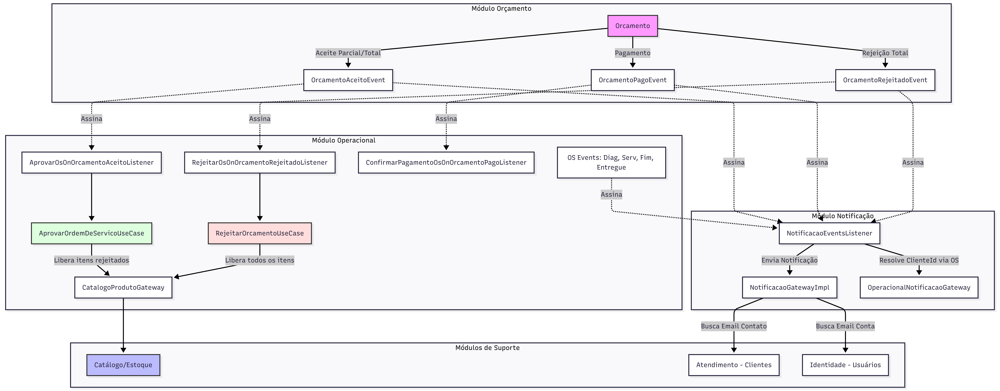

# 🔧 Oficina API

> API RESTful para gestão de uma **Oficina Mecânica**, desenvolvida como parte do **Tech Challenge da FIAP**, aplicando os princípios de **Domain-Driven Design (DDD)** e **Clean Architecture**.


---

## 📋 Sumário

- [Sobre o Projeto](#-sobre-o-projeto)
- [Arquitetura](#-arquitetura)
- [Módulos](#-módulos)
- [Tecnologias](#-tecnologias)
- [Banco de Dados](#-banco-de-dados)
- [Como Executar](#-como-executar)
- [Endpoints](#-endpoints)
- [Testes](#-testes)
- [Cobertura de Código](#-cobertura-de-código)

---

## 🚀 Sobre o Projeto

A **Oficina API** é um sistema backend para gerenciamento completo de uma oficina mecânica, cobrindo desde o catálogo de produtos e serviços até o controle de clientes, veículos e ordens de serviço.

O projeto foi desenvolvido utilizando **Quarkus**, o framework Java nativo em nuvem, com foco em alta performance e arquitetura limpa.

---

## 🏛️ Arquitetura

O projeto segue os princípios de **Clean Architecture** combinados com **Domain-Driven Design (DDD)**, organizando o código em camadas bem definidas e com dependências apontando sempre para o domínio.

```
src/main/java/.../modules/<contexto>/<agregado>/
│
├── domain/                  ← Entidades, Value Objects e regras de negócio puras
│   ├── entity/
│   └── valueobject/
│
├── application/             ← Casos de uso (UseCases), repositórios (interfaces) e DTOs de saída
│   ├── dto/
│   ├── mapper/
│   ├── repository/          ← Interfaces (contratos)
│   └── usecase/
│
├── infrastructure/          ← Implementações concretas (JPA, Panache)
│   └── persistence/
│
└── api/                     ← Controllers REST, DTOs de entrada/saída e mappers de API
    ├── controller/
    └── dto/
```

### Contextos Delimitados (Bounded Contexts)

| Contexto | Agregados |
|---|---|
| `catalogo` | `produto`, `servico` |
| `atendimento` | `cliente`, `veiculo` |
| `identidade` | *(autenticação via JWT)* |
| `operacional` | `ordemdeservico`, `funcionario` |
| `orcamento` | `orcamento` |
| `notificacao` | `envio de mensagens` |
| `relatorios` | `métricas operacionais` |

---

## 📦 Módulos

### 🗂️ Catálogo

| Recurso | Descrição |
|---|---|
| **Produto** | Gestão de peças e insumos com controle de estoque, código de barras e unidade de medida |
| **Serviço** | Gestão de serviços da oficina com tipos (`MANUTENCAO_PREVENTIVA`, `MANUTENCAO_CORRETIVA`) e produtos sugeridos |

### 🧾 Atendimento

| Recurso | Descrição |
|---|---|
| **Cliente** | Cadastro de clientes com endereço completo, CPF/CNPJ e vínculo com usuário |
| **Veículo** | Cadastro de veículos vinculados a clientes, com placa, marca, modelo e ano |

### 🛠️ Operacional

| Recurso | Descrição |
|---|---|
| **Ordem de Serviço** | Ciclo de vida completo (Diagnóstico -> Execução -> Entrega) com controle de esforço e itens |
| **Funcionário** | Cadastro de mecânicos e atendentes vinculados a usuários do sistema |

### 💰 Orçamento

| Recurso | Descrição |
|---|---|
| **Orçamento** | Geração de orçamentos em PDF (Qute), aprovação manual com assinatura e gestão de faturamento |

### 📊 Relatórios

| Recurso | Descrição |
|---|---|
| **Esforço por OS** | Cálculo automático do tempo total de intervenção (minutos) em cada Ordem de Serviço finalizada |
| **Tempo Médio** | Média histórica de execução de cada tipo de serviço para otimização de agenda e custos |

---

## ⚙️ Tecnologias

| Tecnologia | Versão | Uso |
|---|---|---|
| [Quarkus](https://quarkus.io/) | 3.34.5 | Framework principal (runtime Java nativo em nuvem) |
| [Eclipse Vert.x](https://vertx.io/) | — | Comunicação reativa e EventBus para eventos internos de comunicação entre módulos |
| [Java](https://www.java.com/) | 17 | Linguagem de programação |
| [Hibernate ORM + Panache](https://quarkus.io/guides/hibernate-orm-panache) | — | Persistência e repositórios JPA |
| [PostgreSQL](https://www.postgresql.org/) | — | Banco de dados relacional |
| [Flyway](https://flywaydb.org/) | — | Versionamento e migração de banco de dados |
| [DataFaker](https://www.datafaker.net/) | 2.2.2 | Geração de dados realistas para semeadura (Seeding) |
| [SmallRye JWT](https://quarkus.io/guides/security-jwt) | — | Autenticação e autorização via tokens JWT |
| [SmallRye OpenAPI](https://quarkus.io/guides/openapi-swaggerui) | — | Documentação automática da API (Swagger UI) |
| [Hibernate Validator](https://hibernate.org/validator/) | — | Validação de dados de entrada (Bean Validation) |
| [Lombok](https://projectlombok.org/) | 1.18.34 | Redução de boilerplate (getters, construtores) |
| [JUnit 5](https://junit.org/junit5/) | — | Framework de testes unitários |
| [Mockito](https://site.mockito.org/) | 5.11.0 | Mock de dependências nos testes unitários |
| [JaCoCo](https://www.jacoco.org/) | 0.8.12 | Cobertura de código dos testes |
| [Maven](https://maven.apache.org/) | — | Gerenciamento de dependências e build |

---

## 🌱 Semeadura de Dados (Seeding)

Para facilitar o desenvolvimento e testes, implementamos um sistema de **Semeadura Modular** que popula o banco de dados automaticamente ao iniciar a aplicação em ambiente de desenvolvimento.

### Como funciona:
- **Ativação Automática**: O sistema detecta o profile (`quarkus.profile`) e executa apenas se **não** for `prod`.
- **Arquitetura Modular**: Cada módulo possui seu próprio `Seeder` e `Factory` utilizando a biblioteca **DataFaker**.
- **Dados Gerados**:
  - **Identidade**: Usuários administradores, mecânicos e atendentes.
  - **Catálogo**: Produtos com estoque e serviços variados.
  - **Atendimento**: Clientes com endereços brasileiros reais e veículos vinculados.
  - **Operacional**: Gerador automático de 50 Ordens de Serviço distribuídas nos últimos 90 dias, com funcionários atribuídos e tempos de execução randômicos para visualização de métricas reais nos relatórios.

---

## 🗄️ Banco de Dados

O schema é versionado via **Flyway** com migrations incrementais:

| Migration | Descrição |
|---|---|
| `V1.0.0` | Criação da tabela de usuários |
| `V1.0.1` | Criação das tabelas de catálogo (`PRODUTO`, `SERVICO`) |
| `V1.0.2` | Criação das tabelas de atendimento (`CLIENTE`, `VEICULO`) |
| `V1.0.3` | Criação da tabela de Ordem de Serviço |
| `V1.0.4` | Criação das tabelas de itens da OS |
| `V1.0.5` | Criação da tabela de fatura |
| `V1.0.6` | Alterações nas tabelas de `CLIENTE` e `VEICULO` (exclusão lógica, email) |
| `V1.0.9` | Criação da tabela de fatura |
| `V1.1.0` | Adição de suporte a reserva de estoque no catálogo |
| `V1.1.1` | Controle de concorrência otimista (Versioning) para produtos |
| `V1.1.22` | Criação de views para relatórios de esforço e tempo médio |
| `V1.1.24` | Renomear tabela de fatura para orçamento |
| `V2` *(testdata)* | Seeds de produtos e serviços para ambiente de testes |

---

## 🏗️ Arquitetura de Monolito Modular

O projeto foi refatorado para uma estrutura de **Monolito Modular**, garantindo o baixo acoplamento entre os contextos de negócio:

### Comunicação entre Módulos

O sistema utiliza uma arquitetura baseada em **Eventos (Event-Driven)** e **Gateways** para garantir que os módulos sejam independentes e desacoplados:

- **EventBus (Vert.x)**: Comunicação assíncrona para disparar notificações, atualizar estoque e sincronizar estados entre contextos (ex: Aprovação de Orçamento -> Início da OS).
- **Gateways**: Interfaces que definem os contratos de consulta entre módulos, evitando o acoplamento direto entre entidades JPA.
- **SnapshotDTOs**: Troca de informações através de objetos imutáveis, protegendo a integridade do domínio de cada contexto.
- **Isolamento de Banco**: Cada módulo gerencia suas próprias tabelas, respeitando as fronteiras do contexto delimitado.



### 📦 Gestão de Estoque
Implementamos uma lógica de reserva de estoque robusta para evitar vendas de produtos inexistentes:

1.  **Quantidade Física**: Representa o que realmente existe na prateleira.
2.  **Quantidade Reservada**: Representa itens vinculados a Ordens de Serviço abertas/aprovadas.
3.  **Quantidade Disponível**: Calculada dinamicamente (`Física - Reservada`).

**Ciclo de Vida:**
- **Inclusão na OS**: O sistema incrementa a `Quantidade Reservada`.
- **Finalização da OS**: O sistema decrementa tanto a `Quantidade Física` quanto a `Reservada`.
- **Cancelamento da OS**: O sistema decrementa a `Quantidade Reservada`, tornando o item disponível novamente.

### ⚙️ Ciclo de Vida da Ordem de Serviço (Máquina de Estados)
A Ordem de Serviço (OS) segue uma transição estrita de estados para garantir consistência operacional:
- **AGUARDANDO_APROVACAO**: Permite adição de serviços, produtos e envio de orçamentos para o cliente. Serviços corretivos **não** podem ser rejeitados nesta etapa.
- **APROVADA**: Indica que o orçamento foi aceito. Apenas serviços com status `APROVADO` podem ter sua execução iniciada pelos mecânicos.
- **EM_EXECUCAO**: Fase onde os mecânicos iniciam e finalizam tarefas em tempo real, acompanhando a duração exata de cada intervenção.
- **CONCLUIDA**: Encerra a OS. Aciona eventos no EventBus que disparam a baixa de estoque e preparam os dados para faturamento automático.

### 📄 Faturamento e Geração de Documentos
O módulo de faturamento é totalmente assíncrono e dissociado:
- **Separação de Módulos**: Ele coleta dados via "Gateways" (Padrão Adapter), sem referenciar diretamente as tabelas de outros contextos.
- **Geração PDF (Qute + Flying Saucer)**: O Quarkus utiliza sua engine de templates HTML estáticos (Qute) para renderizar layouts premium de nota fiscal (fatura) injetando produtos aninhados em serviços.
- **Baixa Financeira**: Permite confirmar pagamento para liberação e entrega definitiva do veículo ao cliente.

---

## ▶️ Como Executar

### Pré-requisitos

- Java 17+
- Maven 3.8+
- Docker & Docker Compose

### 1. Build do Pacote

Gere o artefato da aplicação ignorando os testes unitários:

```bash
./mvnw clean package -DskipTests
```

### 2. Subir o ambiente com Docker Compose

Com o pacote gerado, inicie os containers do banco de dados e da API:

```bash
docker-compose up -d
```

> A aplicação estará disponível em: `http://localhost:8383`

### 3. Acesse o Swagger UI

A documentação completa da API pode ser acessada em:
[http://localhost:8383/q/swagger-ui/#/](http://localhost:8383/q/swagger-ui/#/)

---

## 🌐 Endpoints

Todos os endpoints seguem o padrão REST e retornam respostas em JSON.
A documentação interativa completa está disponível no Swagger UI após subir a aplicação.

### Catálogo

| Método | Endpoint | Descrição |
|---|---|---|
| `GET` | `/api/produtos` | Listar produtos (paginado) |
| `POST` | `/api/produtos` | Cadastrar produto |
| `PUT` | `/api/produtos/{id}` | Editar produto |
| `DELETE` | `/api/produtos/{id}` | Inativar / deletar produto |
| `POST` | `/api/produtos/{id}/ativacao` | Reativar produto |
| `GET` | `/api/servicos` | Listar serviços (paginado) |
| `POST` | `/api/servicos` | Cadastrar serviço |
| `PUT` | `/api/servicos/{id}` | Editar serviço |
| `DELETE` | `/api/servicos/{id}` | Inativar / deletar serviço |
| `POST` | `/api/servicos/{id}/ativacao` | Reativar serviço |

### Atendimento

| Método | Endpoint | Descrição |
|---|---|---|
| `GET` | `/api/clientes` | Listar clientes (paginado) |
| `POST` | `/api/clientes` | Cadastrar cliente |
| `PUT` | `/api/clientes/{id}` | Editar cliente |
| `DELETE` | `/api/clientes/{id}` | Inativar / deletar cliente |
| `POST` | `/api/clientes/{id}/ativacao` | Reativar cliente |
| `GET` | `/api/veiculos` | Listar veículos (paginado) |
| `POST` | `/api/veiculos` | Cadastrar veículo |
| `PUT` | `/api/veiculos/{id}` | Editar veículo |
| `DELETE` | `/api/veiculos/{id}` | Inativar / deletar veículo |
| `POST` | `/api/veiculos/{id}/ativacao` | Reativar veículo |

### Operacional (Ordens de Serviço)

| Método | Endpoint | Descrição | Roles |
|---|---|---|---|
| `POST` | `/api/ordens` | Abrir nova OS | `ADMIN`, `ATENDENTE` |
| `GET` | `/api/ordens/{id}` | Detalhes da OS | `ADMIN`, `MECANICO`, `ATENDENTE`, `CLIENTE` |
| `POST` | `/api/ordens/{id}/servicos` | Adicionar serviço à OS | `ADMIN`, `MECANICO` |
| `POST` | `/api/ordens/{id}/iniciar-diagnostico` | Iniciar diagnóstico | `ADMIN`, `MECANICO` |
| `POST` | `/api/ordens/{id}/concluir-diagnostico` | Finalizar diagnóstico | `ADMIN`, `MECANICO` |
| `POST` | `/api/ordens/{id}/aprovar` | Aprovar orçamento | `ADMIN`, `ATENDENTE`, `CLIENTE` |
| `POST` | `/api/ordens/{id}/iniciar-execucao` | Iniciar execução (OS) | `ADMIN`, `MECANICO` |
| `POST` | `/api/ordens/{id}/concluir-execucao` | Concluir execução (OS) | `ADMIN`, `MECANICO` |
| `POST` | `/api/ordens/{id}/entregar` | Entrega do veículo | `ADMIN`, `ATENDENTE` |

### Orçamentos

| Método | Endpoint | Descrição | Roles |
|---|---|---|---|
| `GET` | `/api/orcamentos/{id}` | Baixar orçamento (PDF) | `ADMIN`, `ATENDENTE` |
| `POST` | `/api/orcamentos/{id}/aceitar` | Aceitar com assinatura (Base64) | `ADMIN`, `ATENDENTE` |
| `POST` | `/api/orcamentos/{id}/confirmar-pagamento` | Baixa financeira | `ADMIN`, `ATENDENTE` |
| `GET` | `/api/orcamentos/ordem-servico/{id}/json` | Dados do orçamento | `ADMIN`, `ATENDENTE` |

### Relatórios

| Método | Endpoint | Descrição | Roles |
|---|---|---|---|
| `GET` | `/api/relatorios/esforco-os/{osId}` | Esforço total de uma OS específica | `ADMIN`, `MECANICO` |
| `GET` | `/api/relatorios/tempo-medio-servicos` | Média histórica de tempo por serviço | `ADMIN` |

### Paginação

Todos os endpoints de listagem aceitam os seguintes query params:

| Parâmetro | Tipo | Padrão | Descrição |
|---|---|---|---|
| `pagina` | `int` | `0` | Número da página (começa em 0) |
| `tamanho` | `int` | `10` | Itens por página (máx. 100) |
| `incluir_inativos` | `boolean` | `false` | Inclui registros excluídos logicamente |

**Formato da resposta paginada:**
```json
{
  "itens": [...],
  "pagina_atual": 0,
  "tamanho_pagina": 10,
  "total_paginas": 3,
  "total_elementos": 25
}
```

---

## 🧪 Testes

O projeto conta com testes **unitários puros** (sem dependência do container Quarkus), utilizando **JUnit 5** e **Mockito**.

### Executar os testes

```bash
./mvnw test
```

### Suites de teste

| Módulo | Suite | Cenários | Descrição |
|---|---|---|---|
| **Produtos** | `ProdutoTest` | 10 | Regras de domínio e validações |
| | `UseCaseTests` | 11 | Cadastrar, Editar, Deletar, Ativar, Listar |
| **Serviços** | `ServicoTest` | 9 | Regras de domínio e validações |
| | `UseCaseTests` | 9 | Cadastrar, Editar, Deletar, Ativar, Listar |
| | `Mappers/Validators` | 7 | Mapeamento DTO e validação de insumos |
| **Clientes** | `EnderecoTest` | 2 | Value Object de Endereço |
| | `UseCaseTests` | 13 | Cadastrar, Editar, Deletar, Ativar, Listar |
| **Veículos** | `VeiculoTest` | 9 | Regras de domínio e validações |
| | `UseCaseTests` | 9 | Cadastrar, Editar, Deletar, Ativar, Listar |
| **Shared** | `PaginaTest` | 1 | Utilitário de paginação |
| **Total** | | **80** | |

---

### 🔄 Testes de Integração (E2E) com Newman

Para validar o fluxo completo do Monolito Modular (Identidade -> Atendimento -> Catálogo -> Operacional), utilizamos o **Newman**, que é o executor de coleções do Postman via linha de comando.

#### 📦 Instalação do Newman

1.  **Node.js**: Certifique-se de ter o [Node.js](https://nodejs.org/) instalado em sua máquina.
2.  **Instalação Global**: Abra o terminal e execute:
    ```bash
    npm install -g newman
    ```
3.  **Repórter HTML (Opcional)**: Para gerar relatórios visuais:
    ```bash
    npm install -g newman-reporter-htmlextra
    ```

#### 🚀 Executando os Testes

Com a aplicação rodando (`docker-compose up` ou `mvn quarkus:dev`), execute o comando abaixo na raiz do projeto:

```bash
newman run docs/postman_collection.json --env-var "baseUrl=http://localhost:8383"
```

**Para gerar um relatório HTML detalhado:**
```bash
newman run docs/postman_collection.json --env-var "baseUrl=http://localhost:8383" -r htmlextra
```
*O relatório será gerado na pasta `newman/`.*

#### 🧪 O que é testado?

Nossa collection automatizada valida:
1.  **Autenticação**: Fluxo de login e geração de tokens JWT para diferentes perfis.
2.  **Segurança**: Validação de `@RolesAllowed` (ex: Cliente tentando acessar área administrativa).
3.  **Fluxo de Negócio**: Abertura de OS -> Adição de Itens -> Aprovação -> Execução -> Finalização.
4.  **Cálculos**: Verificação de preços totais, descontos e taxas.
5.  **Estoque**: Validação de baixa física e reserva de estoque em tempo real.

---

## 📊 Cobertura de Código

A cobertura é gerada automaticamente com **JaCoCo** ao executar os testes.

```bash
./mvnw clean test
```

O relatório HTML é gerado em:

```
target/site/jacoco/index.html
```

> As camadas de infraestrutura (JPA Entities, Repositories) e controllers são excluídas da cobertura, pois não contêm lógica de negócio testável unitariamente.

---

## 👥 Equipe

Desenvolvido como parte do **Tech Challenge — FIAP**.

---

## 📄 Licença

Este projeto é de uso acadêmico e foi desenvolvido para fins de aprendizagem no contexto da **FIAP**.
